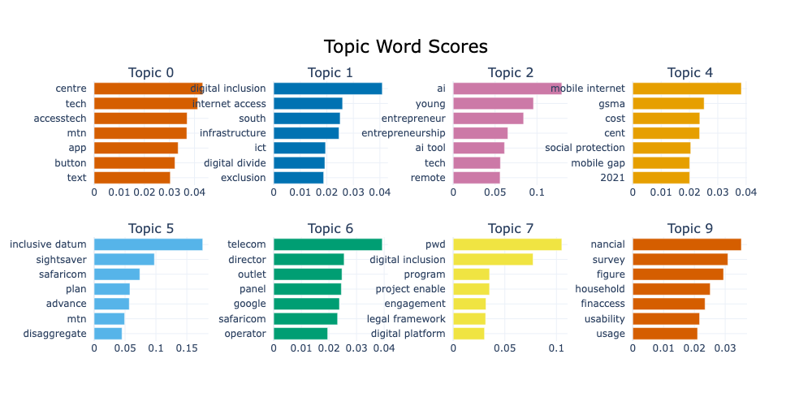
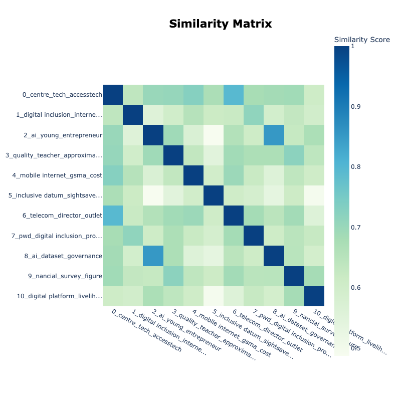
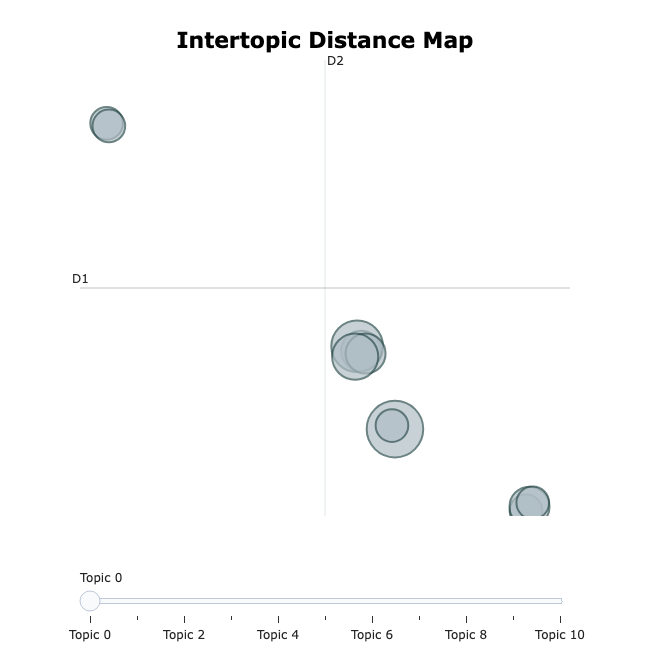
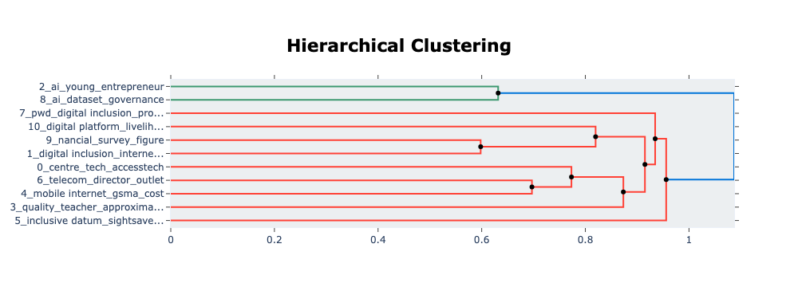

# Data Analysis

Our analytical process followed a sequential flow, beginning with the
**NLP-driven analysis**, which provided a broad, data-driven understanding of
the text. This was then complemented by a more focused **manual coding process**
, allowing for deeper qualitative insights into specific patterns of exclusion.

---

## 🔍 NLP Team's Approach

The NLP team's work began with meticulous **Data Preparation**. Raw PDF files
were extracted, thoroughly cleaned, and preprocessed using Python libraries like
 [**PyMuPDF**](https://pymupdf.readthedocs.io/en/latest/) and
 [**spaCy**](https://spacy.io/). This involved removing stopwords, punctuation,
 and non-relevant tokens to create a clean, structured
 [`cleaned_datasets.csv`](./1_datasets/processed_data/cleaned_datasets.csv) –
 our foundational input for all subsequent NLP tasks.

Following data preparation, our analysis employed a multi-faceted approach
leveraging Natural Language Processing (NLP) and statistical methods:

### 1. [Data Exploration and Initial Analysis](../3_data_exploration/README.md)

We started by inspecting the structure and quality of the
[`cleaned_datasets.csv`](./1_datasets/processed_data/cleaned_datasets.csv),
checking for completeness and relevance to ensure a solid analytical foundation.

---

### 2. [Keyword in Context (KWIC) Analysis](./keywords_in_context_analysis.ipynb)

This qualitative technique allowed us to pinpoint direct mentions and understand
 the nuanced context of key terms (e.g., **'digital'**, **'AI'**, **'exclude'**,**'disability'**,
  **'self-employed'**)
  within the text. This provided granular, sentence-level evidence for our hypothesis.

**Goals for KWIC Analysis:**

* Understand how key terms are framed within their thematic contexts.
* Support qualitative interpretation of textual data.
* Enable exploratory and descriptive insights across themes.

This analysis is useful for exploring how critical terms are framed across
different topics.

---

### 3. 📈 [TF-IDF (Term Frequency-Inverse Document Frequency) Keyword Analysis](../3_data_exploration/top_keywords_per_theme.ipynb)

We used TF-IDF to quantitatively identify the most statistically significant and
 unique vocabulary associated with our predefined themes. This helped us
 highlight terms truly indicative of specific challenges and solutions,
 complementing the qualitative insights from KWIC.

---

### 4. [Topic Modeling Analysis (BERTopic)](./Topic_Modeling.ipynb)

As an advanced neural technique, [**BERTopic**](https://maartengr.github.io/BERTopic/index.html)
 was crucial for moving beyond pre-assigned categories. It utilized document
 embeddings and clustering to uncover latent, naturally emerging conceptual
 themes within the entire dataset. This provided a holistic and semantically
 rich understanding of the various facets of exclusion.

**Key Features of BERTopic Analysis:**

* Loads pre-cleaned text data and filters by predefined thematic categories.
* Defines domain-specific stopwords to reduce noise and enhance topic clarity.
* Uses **UMAP** for dimensionality reduction and **HDBSCAN** for clustering.
* Applies BERTopic to generate interpretable topics.
* Visualizes topics through bar charts and interactive plots.

**Goals for BERTopic Analysis:**

* Identify key discussion patterns and shared language across themes.
* Explore how different topics cut across thematic boundaries.
* Support exploratory qualitative and thematic research.

**Key Visualizations for Topic Modeling:**

## Topic Word Scores

*Purpose: This visualization shows the most important words for each topic and
their relative importance scores, helping understand what characterizes each topic.*

## Similarity Matrix

*Purpose: This heatmap shows how similar each topic is to every other topic.
Darker colors indicate higher similarity, helping identify potentially redundant
 topics or topic clusters.*

## 2D Topic Space

*Purpose: This plot shows topics as circles in 2D space where distance
represents similarity. Topics that are close together are more semantically related.*

## Hierarchical Clustering

*Purpose: This dendrogram shows how topics can be merged at different similarity
 levels, revealing the hierarchical structure of the topic space and which
 topics are most closely related.*

---

## Manual Coding Process

Our manual analysis followed a structured qualitative coding workflow to extract
 insights from 7 documents, about 20% of our data pool. The goal was to identify
  exclusion patterns, thematic prevalence, and co-occurrence relationships
  between access-related issues.

We developed a shared codebook, manually coded excerpts using top-level themes
and subcodes, and cleaned the data for analysis. Pivot tables were used to
calculate theme frequency and co-occurrence patterns. We then wrote memos to
interpret key themes and relationships.

See [`manual_analysis_technical_description.md`](https://github.com/MIT-Emerging-Talent/ET6-CDSP-group-24-repo/tree/main/4_data_analysis)
 for a full explanation of our coding process and rationale.

---

[Coding Sheet (Google Sheet)](https://docs.google.com/spreadsheets/d/1ttROjrY1YECIfhm5oz4luWHxWq_MTShfQBsiFP1Pnvg/edit?gid=894372809#gid=894372809)
