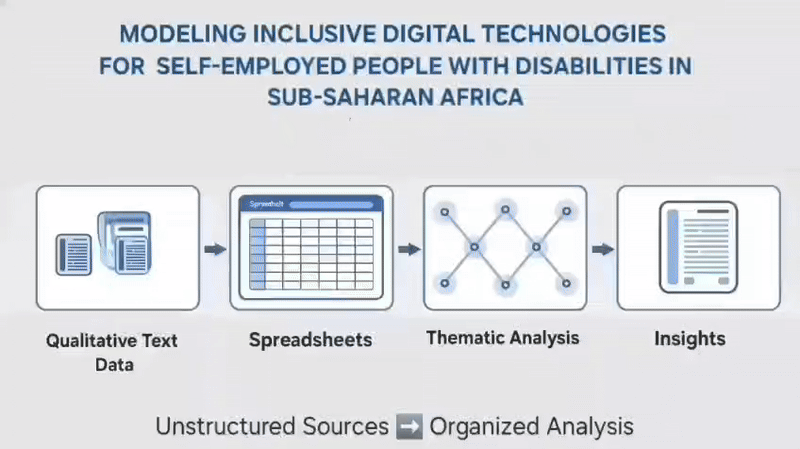

# 

## Welcome to CrystalPearl Rising

Like crystals formed under pressure and
pearls created through transformation, We combine the clarity and strength of
crystal with the wisdom and hidden beauty of pearl to tackle real-world problems
through innovative data-driven insights and cross-cultural collaboration.

🌟 We don't just polish data, we transform raw potential into brilliant insights.

## 🎯 Project Overview

This repository documents our journey through a comprehensive data science
project, from initial problem identification to final presentation. Our work
emphasizes collaborative problem-solving, rigorous analysis, and effective
communication of findings to drive actionable insights.

## 📋 Project Milestones

### Milestone 0: Cross-Cultural Collaboration 🤝🏻

Status: Complete ✅

•⁠  ⁠Established team communication frameworks
•⁠  ⁠Set up collaborative workflows and tools
•⁠  ⁠Set up communication channels for team coordination
•⁠  ⁠Agreed upon and established project constraints
•⁠  ⁠Defined group norms and working agreements
•⁠  ⁠Established individual and team learning goals

### Milestone 1: Problem Identification 🔍

Status: Complete ✅

### Problem Statement

Despite the growing importance of digital technology in driving economic
inclusion, persistent barriers continue to prevent the 1 in 6 people living
with significant disabilities from fully leveraging these tools to pursue
self-employment, achieve self-reliance, and participate meaningfully in the
economy. While self-employment provides a crucial route for persons with
disabilities (PWDs) to bypass traditional labor market barriers and create
income-generating opportunities, the current digital technology ecosystem often
 adopts a reactive stance on accessibility — resulting in systemic exclusion
 rather than proactive inclusion.

This is more than a design flaw — it’s a missed market. Millions of potential
self-employed individuals with disabilities are being left out.

This project explores how digital and AI technologies impact the ability of
self-employed people with disabilities in Sub-Saharan Africa to access and
benefit from the digital economy.

Our aim is not only to identify barriers but also to inform more inclusive
design, highlight untapped opportunities, and support innovation that truly
reflects the needs and potential of people with disabilities pursuing self-employment.

 ⁠🔍 *See our [Background Review](0_domain_study/background_review.md) for
detailed insights*

#### From Struggle to System: The Iceberg of Self Employed People with Disabilities

Iceberg model showing the systemic challenges people with disabilities face when
launching online businesses, from visible struggles to underlying structural and
cultural barriers.

### Actionable Research Question

**"How do digital and AI technologies exclude disabled self-employers  
in Sub-Saharan Africa?"**

---

#### Overview

This research explores whether the ongoing wave of digital innovation—spanning
AI, mobile platforms, and fintech—is truly inclusive of self employed people with
disabilities, particularly in SSA(Sub-Saharan Africa).

While these technologies are often celebrated for democratizing access
and opportunity, many remain inaccessible by design, unintentionally
excluding a vast segment of Self employed people with disabilities.

---

#### Purpose

By examining the lived experiences of Self employed people with disabilities in
SSA , this study aims to uncover:

•⁠  ⁠Where digital inclusion efforts are working?
•⁠  ⁠Where they fall short?
•⁠  ⁠What usability, access, and systemic barriers persist?

The findings will surface actionable insights to inform more inclusive tech ecosystems.

---

#### Strategic Value for Big Tech

This research offers Big Tech companies a chance to:

•⁠  ⁠*Redesign digital tools* to better support self-employed people with
  disabilities through inclusive AI and mobile-first solutions  
•⁠  ⁠*Unlock underserved markets* by reaching a resilient and resourceful user
 group often excluded by default design  
•⁠  ⁠*Enhance model relevance* by incorporating more diverse, real-world data
  that reflects the experiences of disabled users  
•⁠  ⁠*Strengthen ESG impact* by advancing inclusive innovation and contributing
  to global digital equity goals  

---

#### Why It Matters

This isn’t just about accessibility—it’s about shaping the **next generation of
intelligent, ethical, and scalable platforms** across the world’s
fastest-growing digital economies. Inclusion becomes not just a social good, but
a business imperative.

---

> 📈 *Inclusive design is smart design—unlocking new markets, improving AI
fairness, and building platforms that scale ethically.*

---

### Milestone 2: Data Collection 🗂

Status: Complete ✅

## Building Insights from Stories: Our Data Approach

Understanding how technology can inadvertently leave people behind.

---

### The Challenge: Beyond Simple Numbers

Answering our question required more than a few structured spreadsheets. No tidy
 file captures how voice recognition might fail a blind entrepreneur in rural
 Kenya; *exclusion is too nuanced. Furthermore, this specific intersection
  —disability, digital tech, and entrepreneurship in Sub-Saharan Africa — is
  largely underexplored. As a result, comprehensive structured datasets are
  scarce. Given this scarcity and the nuanced nature of exclusion, traditional
 quantitative approaches were insufficient to capture the depth required. Thus,
 we chose to model our problem using qualitative text data*.

---

### Our Approach: Turning Rich Text into Structured Insights

We collect real-world stories from diverse sources: *NGO reports, news
articles, policy documents, blog posts, and corporate announcements*. These texts
 offer rich human insights into approaches, strategies, and disabled
 entrepreneurs' voices. Our task: transform these unstructured narratives into
  an organized dataset, much like weaving individual threads into a
  cohesive tapestry.

---

### How We Structured Our Data

To analyze these stories, we designed custom "data tables" around key research
themes. Each entry in our dataset, a "case," captures a micro-story illustrating
 a **point of exclusion, a barrier encountered, or an innovation's failure to be
  inclusive**.

Here’s a glimpse of the information we meticulously captured:
<!-- markdownlint-disable MD013 -->

| Theme                     | What We Captured                                                                                                                                                                                                                                                                          |
| :------------------------ | :---------------------------------------------------------------------------------------------------------------------------------------------------------------------------------------------------------------------------------------------------------------------------------------- |
| Inclusive Tech Tools | Platforms (e.g., M-Pesa, WhatsApp), accessibility features (or crucial lack thereof), and how AI's design can lead to exclusion.                                                                                                                                                                |
| Tech Ecosystem & Feedback | Actors (e.g., MTN, CBM), their inclusion efforts (or failures in design, hiring, funding, policy), and how insufficient PwD feedback mechanisms or ignored feedback leads to exclusion.                                                                                               |
| Digital Infrastructure | Gaps in internet/mobile coverage, unreliable power access, and other persistent infrastructure barriers that create exclusion.                                                                                                                                                          |
| Entrepreneurship Case Studies | Stories of disabled entrepreneurs facing digital barriers, challenges in accessing tools, or instances where digital systems hinder their livelihoods.                                                                                                                            |
| Barriers to Access | Specific UX problems, affordability issues, societal stigma manifesting digitally, or policy gaps limiting inclusion and fostering exclusion.                                                                                                                                            |
<!-- markdownlint-enable MD013 -->
For instance, a single row might detail how even initiatives like *MTN piloting
 voice banking in Nigeria* could inadvertently *exclude users without specific
 device compatibility;
 how CBM's mentoring programs might face barriers in
 scaling digital access; or how**Safaricom's M-Pesa redesign, despite good
 intentions*, still leaves gaps for certain assistive technology users.

---

### Why This Approach Works

We chose this method because key exclusion patterns are often *non-numerical.
 Insights lie in detailed accounts, lived experiences, and specific
 shortcomings in innovations. This qualitative-first approach allows us to
 follow the real signals of change and challenges that quantitative data alone
 might miss.

---

### Understanding Our Data: What It Reveals and Its Limitations

Our modeling provides rich, real-world examples of *how exclusion manifests and
where digital technologies fall short. It primarily identifies **shortcomings,
 barriers, and patterns of exclusion. It reveals
gaps in feedback loops** and highlights stories of exclusion and the **challenges
faced**. It offers a structured lens to compare actors and spot patterns in
accessibility, AI, infrastructure, and policy that lead to exclusion.

However, like any robust research method, it comes with limitations, often due
to the novel nature of our research area and practical constraints:

•⁠  ⁠Visibility Bias: Relies on publicly available reports; might underrepresent
  grassroots efforts or less documented instances of exclusion.
•⁠  ⁠Qualitative Ambiguity: Interpreting narratives can be subjective;
  pinpointing exact causes or comparative "levels" of exclusion is challenging.
•⁠  ⁠Lack of Direct User Data: Most insights are secondhand from reports, not
  direct PwD (People with Disabilities) interviews, potentially missing
granular experiences of exclusion.
•⁠  ⁠No Statistical Generalizability: Captures specific cases and patterns, not
  broad statistical representation across Sub-Saharan Africa.
•⁠  ⁠Inconsistent Depth: Detail levels vary across sources.
•⁠  ⁠Manual Structuring in Underexplored Domains: Given the largely
unresearched nature of this specific intersection, the process of manually
structuring this qualitative data was extensive and resource-intensive.
•⁠  ⁠Time and Financial Constraints: Limited time and funding prevented us from
   conducting more structured data collection methods, such as original surveys
   or in-depth interviews. This practical limitation shaped the scope of our methodology.

---

### The Value: A Navigational Map

Our dataset serves as a detailed map, not a perfect mirror. It helps
pinpoint **where digital and AI technologies create barriers and crucial gaps
 for self employed people with disabilities in SSA**. This framework lays the
 groundwork for future research, policy development, and *interventions aimed
  at mitigating exclusion and fostering truly inclusive tech innovation, truly
  embodying the*‘Rising’ spirit of our team’s objectives.

---

### Want to See It?

Explore our datasets here → [🔗 View the Datasets](1_datasets)
Each row represents a specific story of exclusion, a barrier, or an innovation's
 failure in action.

---

## 📁 Repository Structure

text
├── README.md                           # This file
├── 0_domain_study/                    # Initial domain research and exploration
├── 1_datasets/                        # Data storage and management
├── 2_data_preparation/                # Data cleaning and preprocessing
├── 3_data_exploration/                # Exploratory data analysis
├── 4_data_analysis/                   # Advanced analysis and modeling
├── 5_communication_strategy/          # Communication strategy for research findings
├── 6_final_presentation/              # Final deliverables and presentations
├── collaboration/                     # Team collaboration documents
├── notes/                             # Team notes on project process and learnings
└── requirements.txt                   # Project dependencies

## 👥 Team Members

| Name | GitHub |
|------|--------|
| Jola-Moses | [@jola-ds](https://github.com/jola-ds) |
| Karim Makie | [@KarimMakki](https://github.com/KarimMakki) |
| Muqadsa Tahir | [@MuqadsaT](https://github.com/MuqadsaT) |
| Omer Dafaalla | [@omerdafaalla](https://github.com/omerdafaalla) |
| Omnia Mustafa Abdulgadir | [@Omnia-Agabani](https://github.com/Omnia-Agabani) |
| Robel Mengsteab | [@robi-mengs](https://github.com/robi-mengs) |

### 📍 Getting Started

For setup instructions and contribution guidelines, please see our
[CONTRIBUTING.md](/CONTRIBUTING.md) file.

### 🤝🏻 Collaboration Framework

- 📋 [Our Group Norms](collaboration/README.md)
- 🎯 [Learning Goals](collaboration/learning_goals.md)
- 💬 [Communication](collaboration/communication.md)
- 🚧 [Constraints](collaboration/constraints.md)
- 🔍 [Retrospectives](collaboration/retrospectives)

## 🏆 Success Metrics

- *Technical Excellence*: Robust analysis with appropriate methods
- *Collaboration Quality*: Effective cross-cultural teamwork
- *Communication Impact*: Clear, actionable insights for target audience
- *Learning Outcomes*: Demonstrated growth in data science skills
- *Innovation Potential*: Identification of future opportunities

## 📝 License

This project is licensed under the MIT License - see the [LICENSE](LICENSE) file
for details.

---

🗓 Last Updated: 30th June 2025
